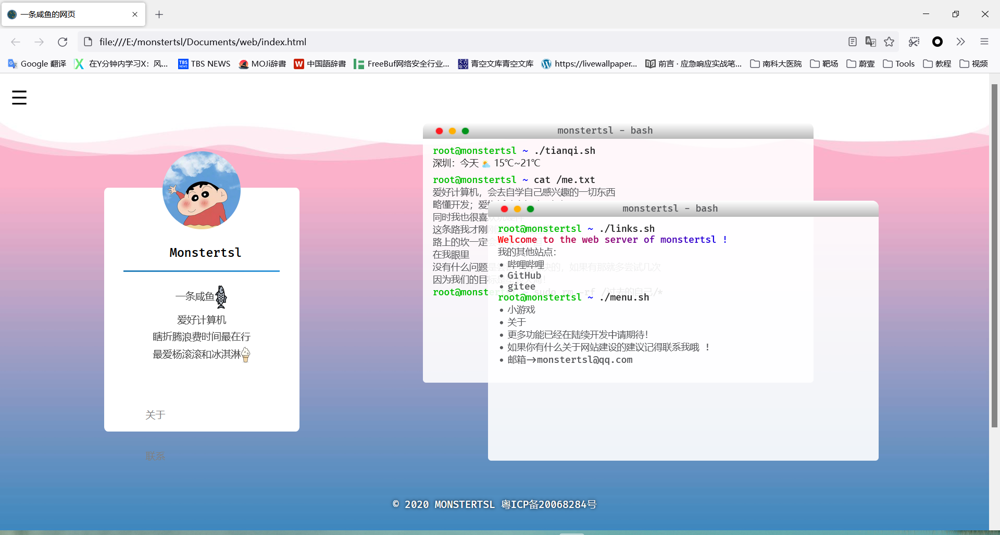
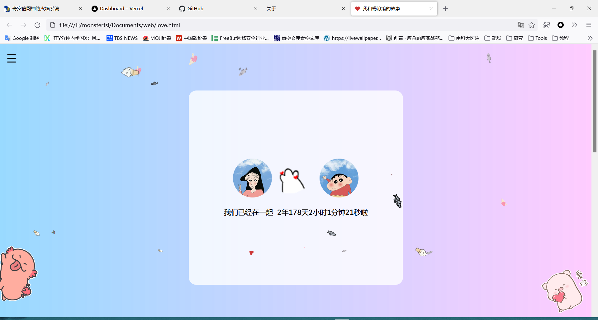

在这之前我也搭建过一个博客网站，当时是因为白嫖到了服务器，平时用得很少所以就搭建了个博客网站，但是当时并没有使用开源的框架，手写了一个简单的框架来使用，页面其实比较粗糙（见下图）
 

刚好最近有空闲的时间所以就像再重新搭建一个博客网站，可以记录分析一下日常的工作学习。

博客使用[hugo](https://gohugo.io/)开源框架搭建而成，模板使用的是[小球飞鱼](https://mantyke.icu/),修改版本的[Stack](https://docs.stack.jimmycai.com/zh/),托管在`GitHub`上面,使用[vercel](https://vercel.com)进行托管加速

如果你有什么好的建议，或者有什么意见请使用邮箱<monstertsl@qq.com>联系我