---
#标题
title: "Burp Suite Pro安装破解"
#副标题
description: "工欲善其事必先利其器，5分钟学会安装原版Burp Suite Pro"
#日期
date: 2022-05-26
#封面图片
image: Burp Suite Professional.png
#协议信息，可以设置false
license: false
#优先级
weight: 
#隐藏文章，默认false
hidden: 
#分类
categories:
    - 教程
    - 笔记
    - 渗透工具
#标签
tags:
    - BurpSuite
    - 渗透工具
    - 破解
#显示 / 隐藏目录，默认true
toc:
#最后修改时间
lastmod:
---


工欲善其事必先利其器


>还记得刚开始接触安全的时候，为了搞到各种工具，求爷爷告奶奶的，其中也走了不少弯路，其实很多工具我们是可以直接去下载官网的原版自己破解，一方面可以摆脱一些限制，另一方面自己破解的工具还是相当安全一些的，毕竟去下载的破解好的其实不太好分辨有没有被植入后门木马

## 前期准备

### 运行环境
根据官方页面的提示`Burp Suite现在需要Java11或者更高版本才能运行`

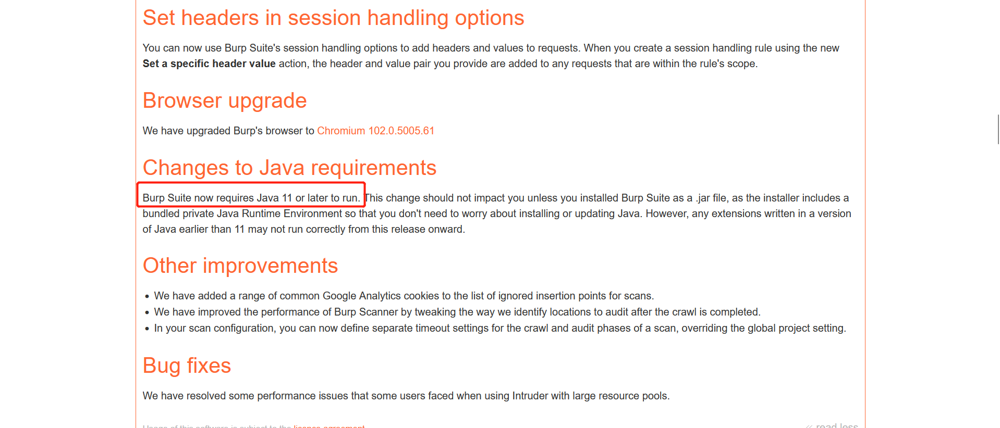

所以我需要先安装Java

#### 下载Java
打开[Java Downloads](https://www.oracle.com/java/technologies/downloads/)下载页面，往下滑动（这里建议使用`11<=Java<17`的版本，所以我这里下载11），再选择对应的操作系统下载就好了，我的是Windows平台

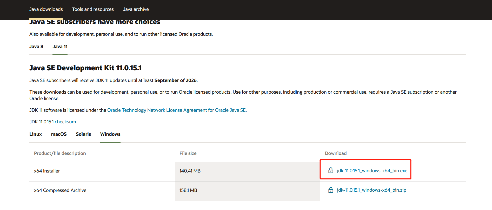

因为官网有时候不太好使同时提供网盘下载[Java](https://www.aliyundrive.com/s/MN2f3zzLSpj)

#### 安装Java环境
下载好后就直接双击允许，一直点击`下一步`默认安装即可
>新版的Java已经不需要像之前的旧版本那样还要自己配置环境变量，安装过程中它就会自动配置

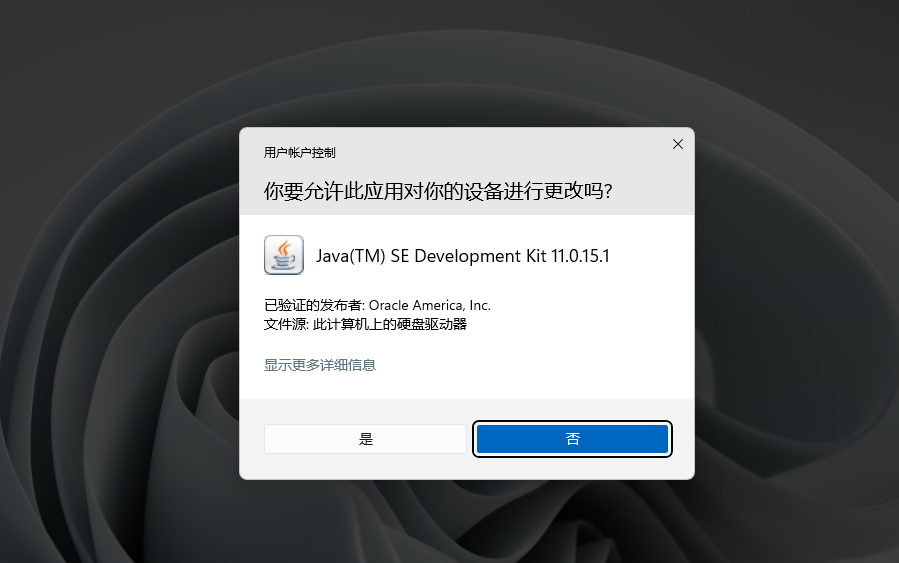
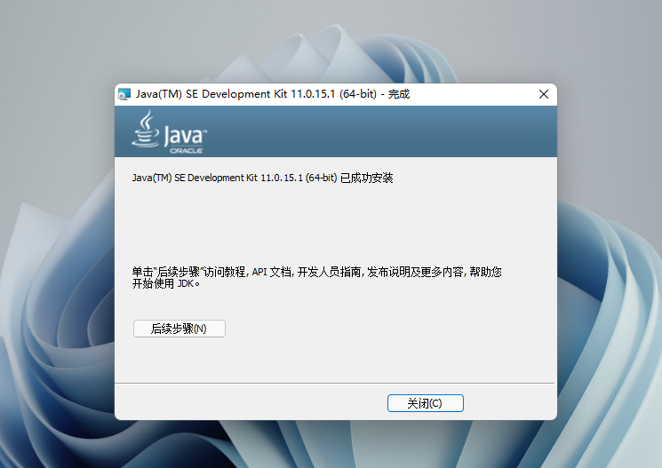

#### 验证Java环境

打开我们的控制台输入命令`java -version`，只要可以正常输出版本信息就表示配置好了，如果没有显示就尝试重启一下设备，或者重新安装

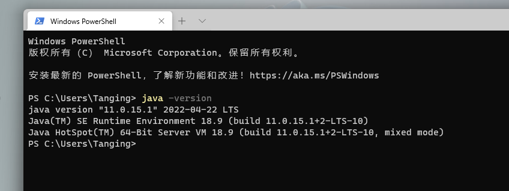

## 下载BurpSuite

打开Burp Suite发布页面[Burp Suite Releases](https://portswigger.net/burp/releases)可以看见上面提供了企业/专业/社区版的原包下载

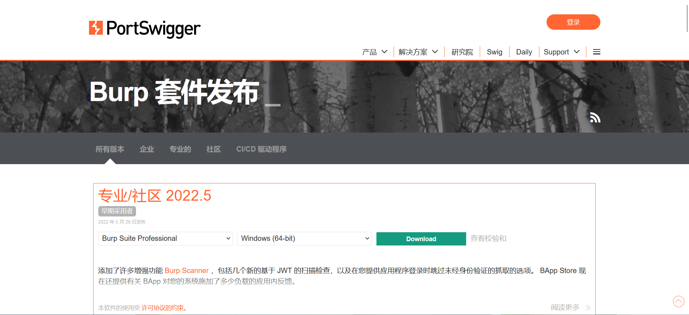

挑选一个我们喜欢的版本，选择下载`jar`包，不需要下载对应系统的版本，直接下载`jar`原包就好了

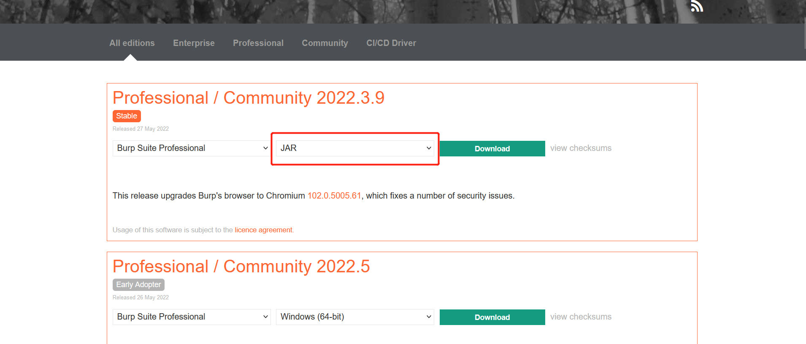

## 破解
我们直接下载的官方包需要通过注册机的破解才能正常的使用

### 注册机下载
这里提供两个版本的注册机（中文/英文）

[BurpLoaderKeygenCn.jar，包含中文翻译文件，提取码: 60fa](https://www.aliyundrive.com/s/CgDZb7oUpp6 )

[BurpLoaderKeygen.jar，只有破解功能，提取码: cd55](https://www.aliyundrive.com/s/V2Sba28PBC8)

### 破解Burp Suite

将注册机和下载的Burp Suite放在同一个目录里面（方便下面操作）

#### 运行我们的注册机（二选一即可）
```java
 java -jar .\BurpLoaderKeygen.jar
```

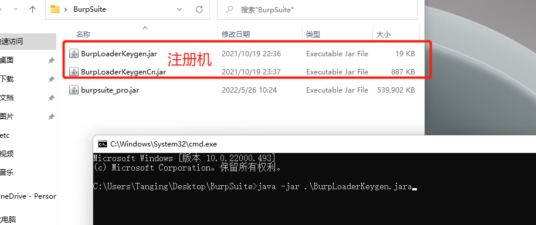

可以看见我们的注册机已经识别到同目录下的BurpSuite包文件

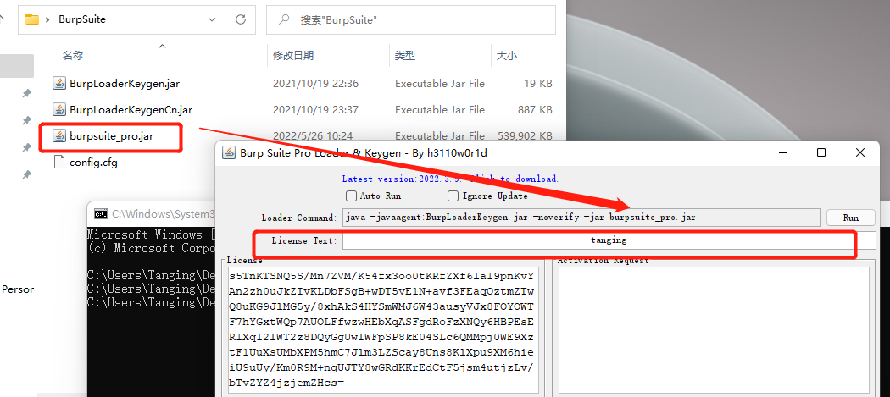

在`License Text`部分随便填写什么都可以不影响，它会显示到最后破解完成的Burp Suite上面

点击`run`使用注册机运行Burp Suite

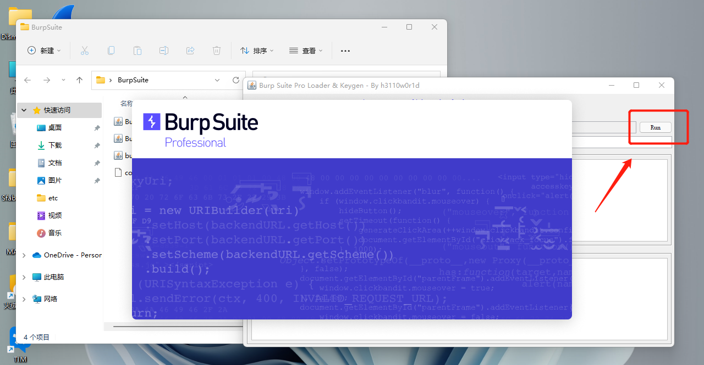

点击`I Accept`接受协议

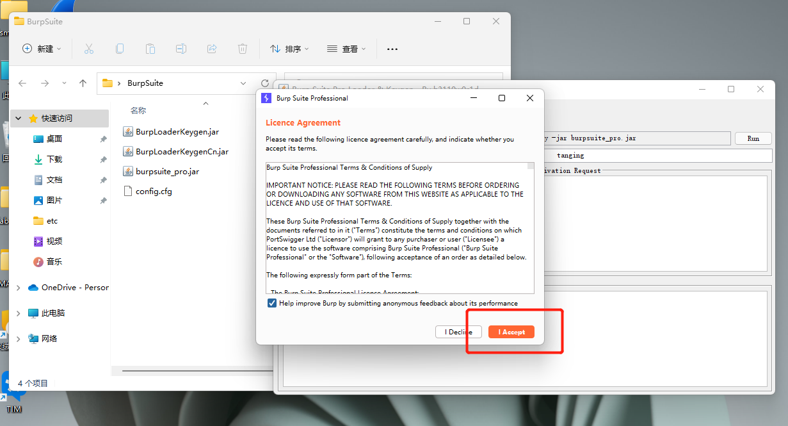

#### 破解步骤

将生成的license复制到Burp Suite点击`Next`,再在弹出的窗口选择`Manual activation`

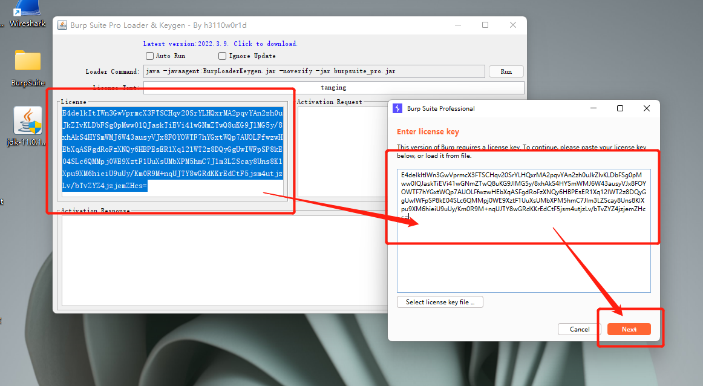
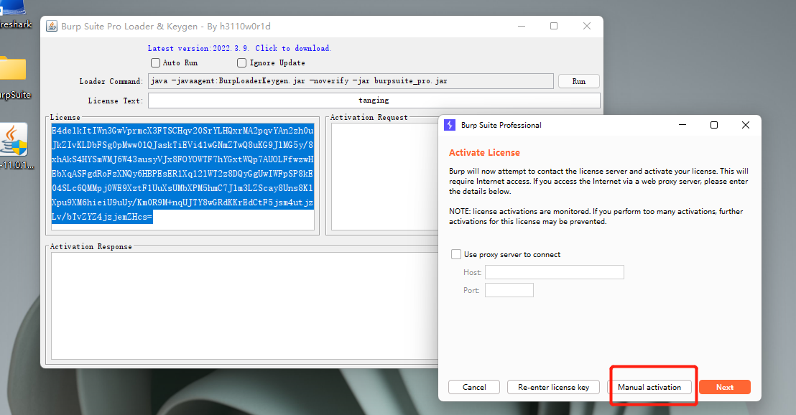

点击复制将Burp Suite生成的激活license复制到注册机，注册机就会在下面自动生成注册license
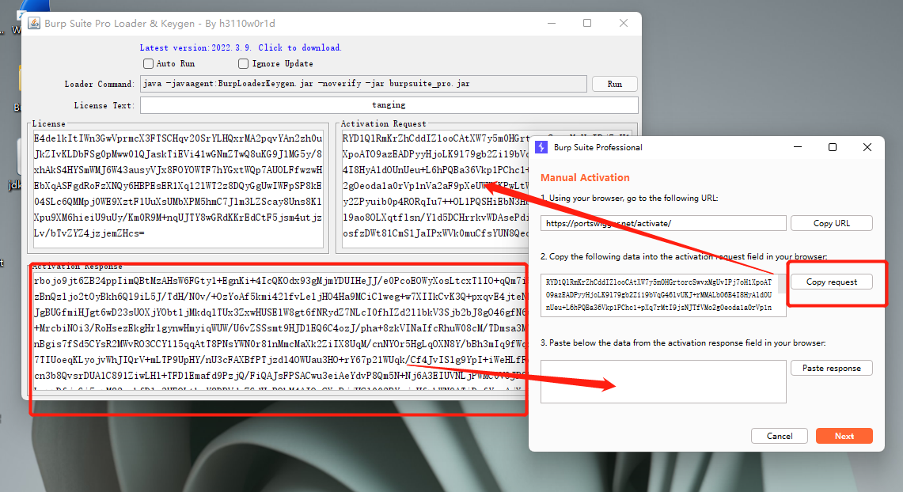

将注册机生成的license粘贴到Burp Suite下面的框里面，点击`Next`激活，激活成功后点击`Finish`就可以正常使用了

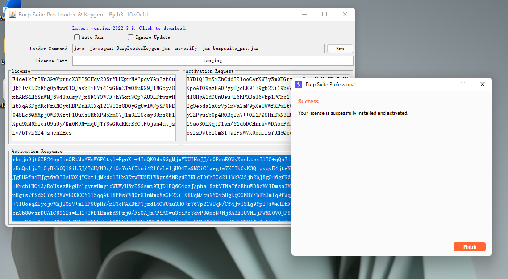
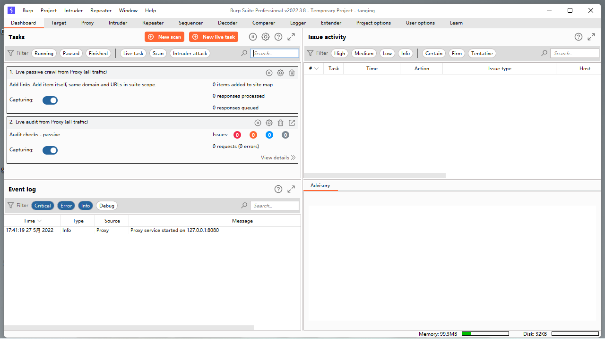

## 后续使用

>当第一次破解后，后面的使用以及更新就不需要再重新破解了，除非换设备了就需要再重新走一次破解步骤

### 运行

当我们破解完成后就可以直接通过注册机的代理启动来正常使用Burp Suite

将注册机和Burp Suite放置到同一个目录下，打开控制终端定位到这个目录，使用命令启动。<cite>**在使用的过程中不能关闭命令窗口不然会直接中断这个进程的运行**</cite>

```java
 java -noverify -Dsun.java2d.uiScale=1 --illegal-access=permit -javaagent:".\BurpLoaderKeygen.jar" -Xmx2048m -jar ".\burpsuite_pro.jar"
```
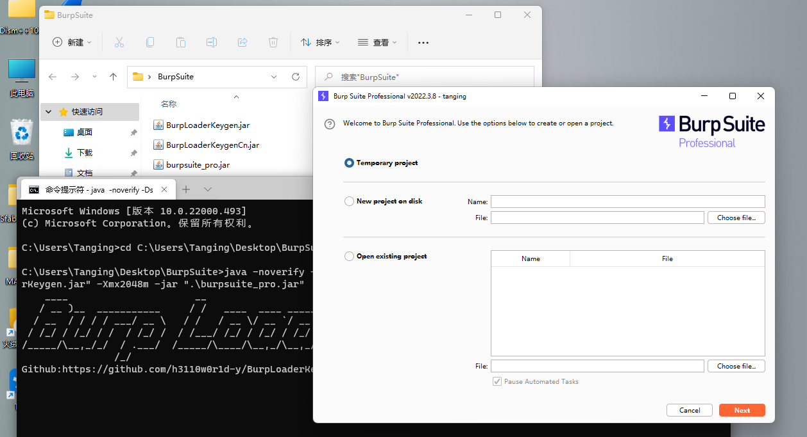

#### 使用带中文的注册机

如果想要使用中文版本可以使用带语言包的注册机来启动，启动的命令大致的相同的但是有个小地方需要注意,需要加上`-Dfile.encoding=utf-8`设置编码格式为`uft-8`免得出现中文错误的问题，同时需要给注册机加上`=cn`的参数告诉它使用中文，不然还是英文启动

```Java
 java -noverify -Dsun.java2d.uiScale=1 --illegal-access=permit -Dfile.encoding=utf-8 -javaagent:".\BurpLoaderKeygenCn.jar=cn"  -Xmx2048m -jar ".\burpsuite_pro.jar"
```
##### 参数解释

```java
-noverify   关闭类验证(加快启动)

-Dsun.java2d.uiScale=1  限制dpi自适应及UI缩放(解决高分辨率屏幕不清晰的问题)

--illegal-access=permit 允许访问封装的包以及反射其他模块(一般使用Java16以上才需要，这里为了保险)

-javaagent: 代理启动后面接注册机

-Xmx2048m   Xmx是用来设置你的应用程序能够使用的最大内存数 2048m就是2G内存

-jar    执行jar文件
```

#### 快捷启动

有些人喜欢使用英文原版有些人喜欢汉化过的界面，所以为了方便，我们可以写个脚本来控制启动,把脚本和之前的文件放到同一目录就行了，方便快捷

```bat
@echo off
title BurpSuite启动器by monstertsl
color 70 & cd /d "%~dp0"

echo.-----------------------------------------------------------
echo 请选择 BurpSuite的运行语言
echo 【C】汉语
echo 【E】English
echo.-----------------------------------------------------------
echo.

set /p language=请输入你的选择并按回车键确认:

echo.
if /i "%language%"=="c" cls&goto zh
if /i "%language%"=="e" cls&goto en

:en
cls
echo.
java -noverify -Dsun.java2d.uiScale=1 --illegal-access=permit -javaagent:".\BurpLoaderKeygen.jar" -Xmx2048m -jar ".\burpsuite_pro.jar"
exit

:zh
cls
echo.
java -noverify -Dsun.java2d.uiScale=1 --illegal-access=permit -Dfile.encoding=utf-8 -javaagent:".\BurpLoaderKeygenCn.jar=cn"  -Xmx2048m -jar ".\burpsuite_pro.jar"
```

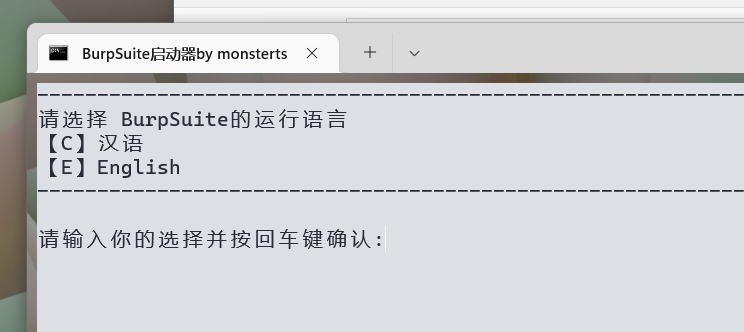

#### 一些细节问题

在使用Burp Suite的时候会遇到抓到的包其中包含汉字，但是汉字显示是一个小方块`▢`,这个时候只需要在`User options`➝`Display`➝`HTTP Message Display`中修改个中文字体就可以了（实测黑体最好看了）

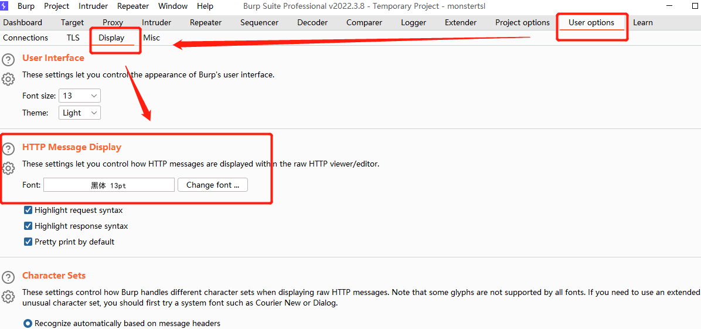

>如果后续还有什么问题，或者链接挂掉了请留言或者直接发[邮件](monstertsl@qq.com)联系我