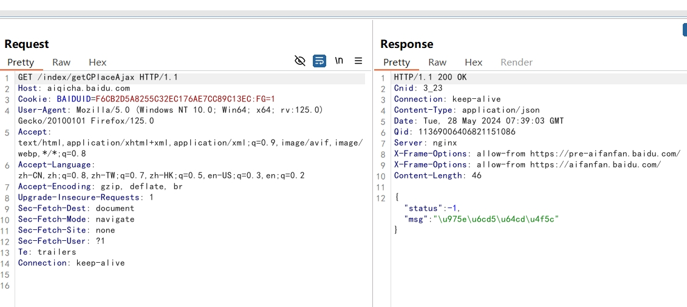
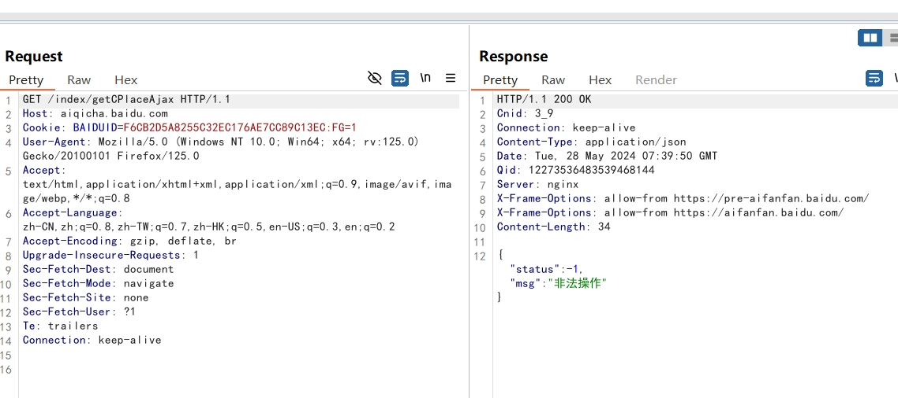

---
#标题
title: "UnicodeAutoDecoder"
#副标题
description: 自动将BurpSuite抓包、重放、爆破中的Unicode编码转换为易于阅读的自然语言编码(UTF-8)
#日期
date: 2024-05-29
#封面图片
image: 
#协议信息，可以设置false
license: 
#优先级
weight: 
#评论开关，默认false,如果使用了这个关键字会关闭评论，如果要开启评论，删除这个关键字即可
comments: 
#隐藏文章，默认false
hidden: 
#分类
categories:
    - 插件
    - BurpSuite
    - 渗透工具
#标签
tags:
    - 
#显示 / 隐藏目录，默认true
toc:
#最后修改时间
lastmod:
---

自动将BurpSuite抓包、重放、爆破中的Unicode编码转换为易于阅读的自然语言编码(UTF-8)  
Auto converts Unicode encodings in Proxy, Repeater, and Intruder into easy-to-read natural language

参考以下两个项目进行创建  
Refer to the following two authors create project  
https://github.com/amir-h-fallahi/UnicodeDecoder  
https://github.com/no001ce/N-DecodeAllUnicode  

因为一开始我使用的是[UnicodeDecoder](https://github.com/amir-h-fallahi/UnicodeDecoder),后面发现他会导致在重放和爆破的时候对请求/响应中的中文进行编码，导致无法正常阅读，所以在[UnicodeDecoder](https://github.com/amir-h-fallahi/UnicodeDecoder)的基础上，参照[N-DecodeAllUnicode](https://github.com/no001ce/N-DecodeAllUnicode)进行修改

## 使用方式
脚本使用python编写，需要先在BurpSuite中配置python环境，安装[Jython](https://www.jython.org/download.html)在Java环境中实现python
BurpSuite - Extensions(扩展) - Extensions settings(扩展设置) - Python environment（Python环境） - Location of Jython standalone JAR file（Jython的JAR文件位置） - Select file（选择文件）
选择下载好的[Jython](https://www.jython.org/download.html)
### 载入插件
BurpSuite - Extensions(扩展) - Installed（安装） - Burp extensions（Burp扩展） - Add（添加） - Extension type（扩展类型） - Python - Extension file - Select file（选择文件）
选择下载好的[UnicodeAutoDecoder](https://github.com/monstertsl/UnicodeAutoDecoder)

## 演示
#### 未使用



#### 使用



## 源码

```python
# coding=utf-8
from burp import IBurpExtender, IHttpListener
import re

class BurpExtender(IBurpExtender, IHttpListener):

	def registerExtenderCallbacks(self, callbacks):
		self._callbacks = callbacks
		self._helpers = callbacks.getHelpers()
		callbacks.setExtensionName("UnicodeAutoDecoder")
		callbacks.registerHttpListener(self)
		callbacks.printOutput("UnicodeAutoDecoder By monstertsl")
		callbacks.printOutput("Auto converts Unicode encodings in Proxy, Repeater, and Intruder into easy-to-read natural language")
		callbacks.printOutput("GitHub: https://github.com/monstertsl/UnicodeAutoDecoder")
		callbacks.printOutput("Refer to the following two authors create project")
		callbacks.printOutput("GitHub: https://github.com/amir-h-fallahi/UnicodeDecoder")
		callbacks.printOutput("GitHub: https://github.com/no001ce/N-DecodeAllUnicode")


	def processHttpMessage(self, toolFlag, messageIsRequest, messageInfo):
		toolName = self._callbacks.getToolName(toolFlag)
		if toolName == "Repeater" or toolName == "Proxy" or toolName == "Intruder":
			if not messageIsRequest:
				is_response_json = False

				response = messageInfo.getResponse()
				analyzedResponse = self._helpers.analyzeResponse(response)
				response_headers = analyzedResponse.getHeaders()

				for header in response_headers:
					if header.lower().startswith("content-type: application/json"):
						is_response_json = True
				
				if is_response_json:
					body = response[analyzedResponse.getBodyOffset():]
					bodyStr = body.tostring()
					u_escape = re.findall(r'\\u[a-z0-9A-Z]{4}', bodyStr)
					u_escape = list(set(u_escape))
					if u_escape:
						for i in u_escape:
							decodeUnicodes = i.decode('unicode_escape').encode('utf8')
							bodyStr = bodyStr.replace(i, decodeUnicodes)
						finalModifiedBody = self._helpers.stringToBytes(bodyStr)
						messageInfo.setResponse(self._helpers.buildHttpMessage(response_headers, finalModifiedBody))
```

## 测试URL  
https://aiqicha.baidu.com/index/getCPlaceAjax  
https://passport.baidu.com/v2/api/getqrcode