---
#标题
title: "将搭建好的博客文件托管到GitHub并且使用vercel来进行博客内容创建托管"
#副标题
description: 将我们搭建好的博客展示出来
#日期
date: 2022-03-07
#封面图片
image: cover.png
#协议信息，可以设置false
license: 
#优先级
weight:  
#隐藏文章，默认false
hidden: 
#分类
categories:
    - 教程
    - 笔记
#标签
tags:
    - GitHub
    - Hugo
    - vercel
    - blog
#显示 / 隐藏目录，默认true
toc:
#最后修改时间
lastmod:
---

>在前一篇文章[零基础，从 0 到有使用 hugo 搭建个人博客](https://www.tanging.tk/%E9%9B%B6%E5%9F%BA%E7%A1%80%E4%BB%8E0%E5%88%B0%E6%9C%89%E4%BD%BF%E7%94%A8hugo%E6%90%AD%E5%BB%BA%E4%B8%AA%E4%BA%BA%E5%8D%9A%E5%AE%A2/)中，已经用了非常详细的语言来描述如何使用hugo这个框架来搭建个人博客，并且进行本地生成测试，这篇文章也会十分详细的用识字老奶奶都看得懂的教程详细的告诉大家怎么将自己搭建好的博客放到公网上面

# 使用GitHub进行博客文件托管

因为我们在自己本地搭建好的博客是在只能自己访问的，所以我们如果想要将自己搭建好的博客放到公网上面就需要在公网上有地方来储存我们的博客文件，这个时候像[GitHub](https://github.com/)或者[Gitee](https://gitee.com/)这种托管网站就非常的适合,但是这这里就出现了一个问题`Gitee`比较快，但是限制比较多，`Github`有时候又很慢甚至上不去，所以我们就需要用到[vercel](https://vercel.com),来帮助我们对博客进行静态生成页面托管

## 创建GitHub账号

打开[GitHub](https://github.com/)，点击右上角的`Sign up`开始注册账号，它会一步一步的引导操作，邮箱-密码-用户名（建议多想一下好的因为不能重复）-是否接收广告，然后就是一些个性化的东东，所以创建账号这步就不做过多阐述
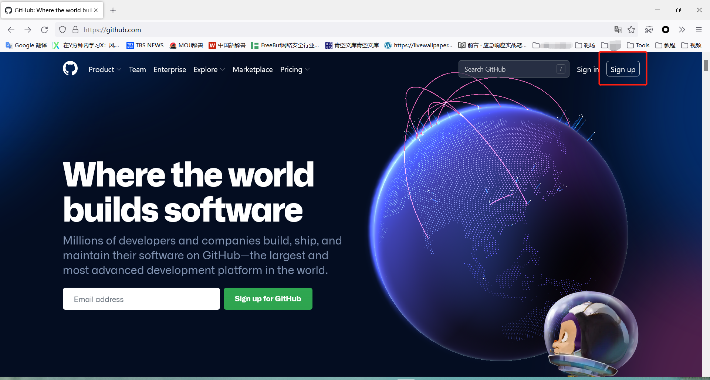
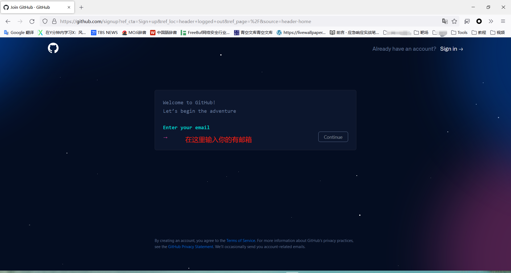

**GitHub的使用过程中可能会受到网络的影响，所以请多一点点耐心**

## 创建仓库

**注意现在使用两种方法上传到GitHub（见下文），如果使用GitHub桌面客户端的话，可以不用先创建仓库，请选择适合自己的方法**

当我们创建好GitHub账号之后就需要创建一个用来储存我们博客文件的仓库

点击图中我圈出来的两个地方中的任意一个都是创建仓库的（如果觉得英文界面不方便也可以使用插件来进行翻译）
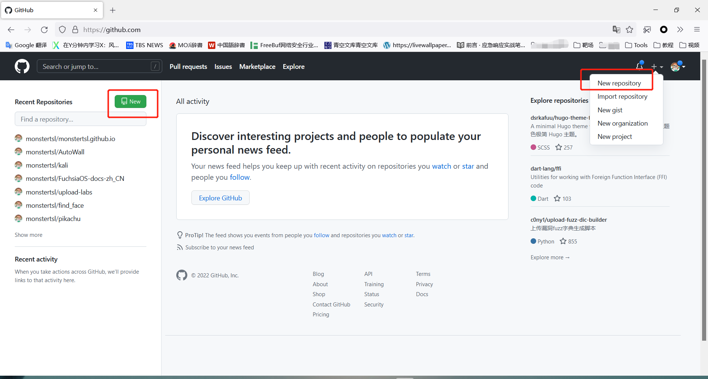

填写好要创建的仓库名，仓库名看个人喜好叫blog或者***blog都行反正看自己，选择是否公开，再创建就可以了，建议将`Add a README file(添加自述文件)`给勾选上（这里为了方便附上中文界面对照）
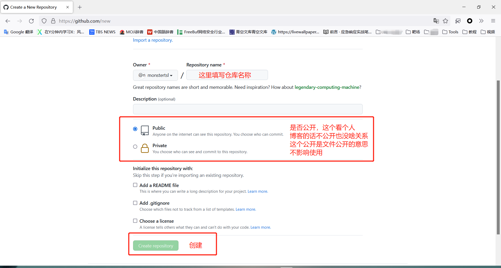
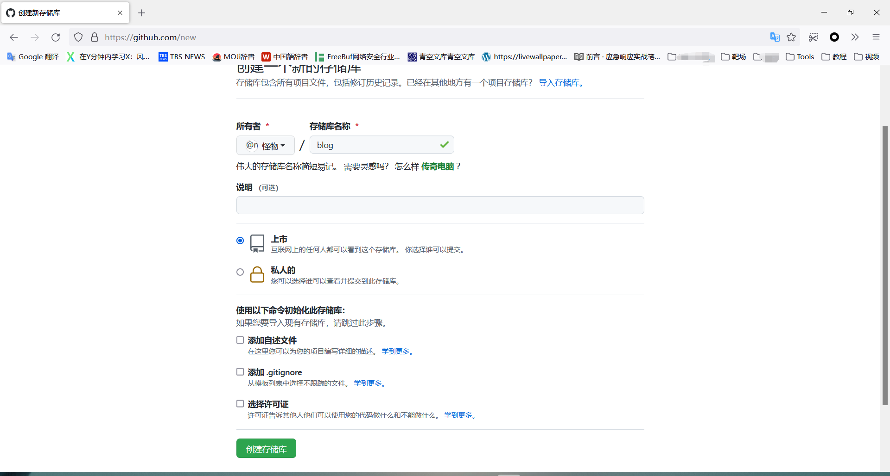

现在仓库已经创建好了，它就来到了仓库初始页面
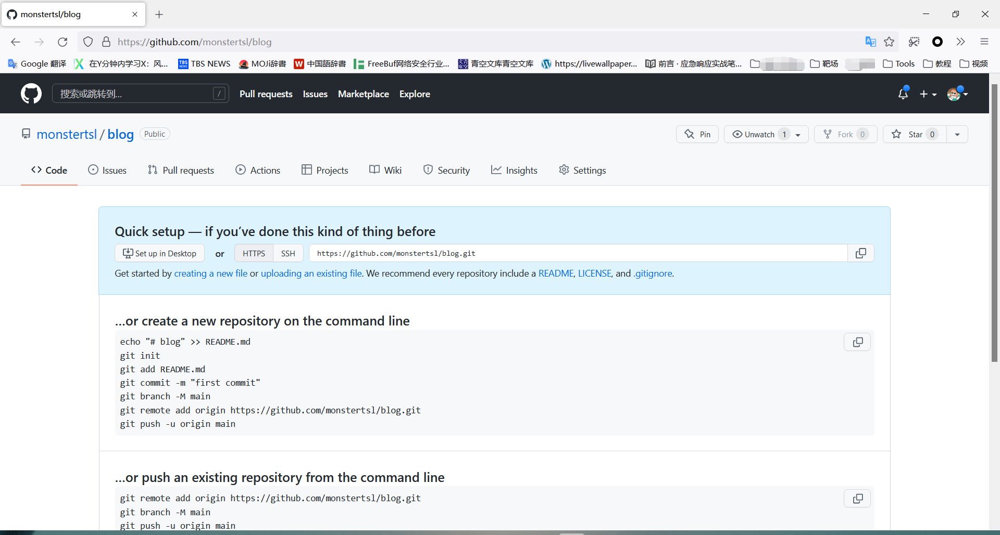
根据页面提示有两种方法可以将我们的文件上传到仓库，使用GitHub桌面客户端或者使用git工具，我们现在分两种来介绍，大家根据自己的需求来使用

### 使用GitHub桌面客户端上传（较简单）

点击这个➡[GitHub Desktop](https://desktop.github.com/)下载GitHub桌面客户端，运行它就会自动安装
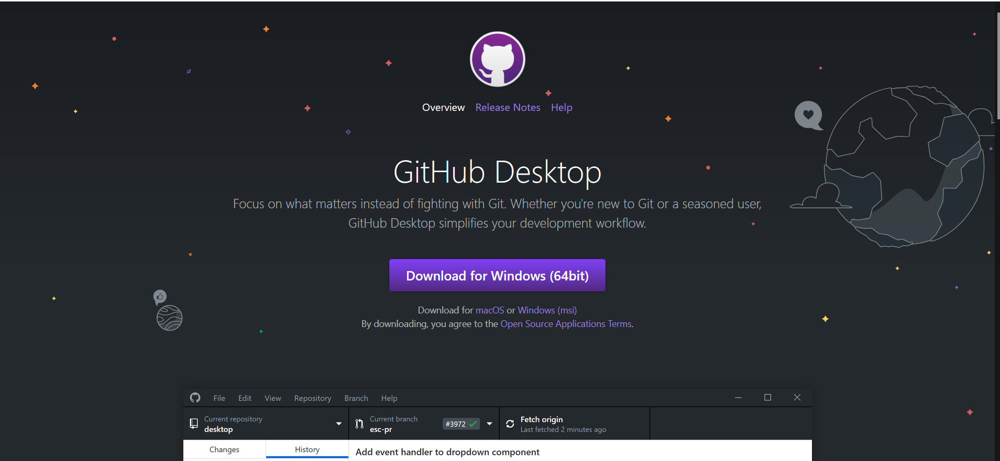
打开GitHub Desktop，点击`Add an Existing Repository from your hard drive`，然后选择博客文件路径，但是它现在会提示让你创建成一个储存仓库，因为它现在还不是一个仓库，点击下面的`create repository`就会自动跳转到创建仓库，它会帮你填写好信息，直接创建就可以了
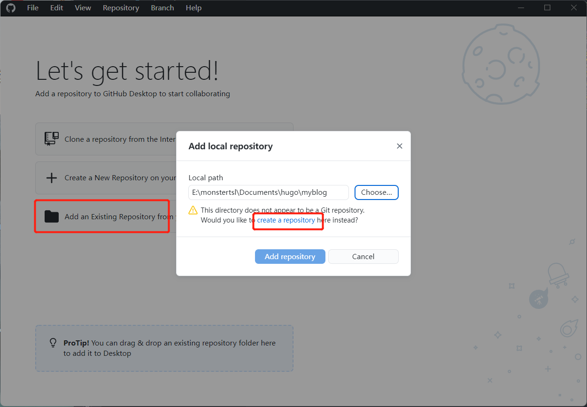
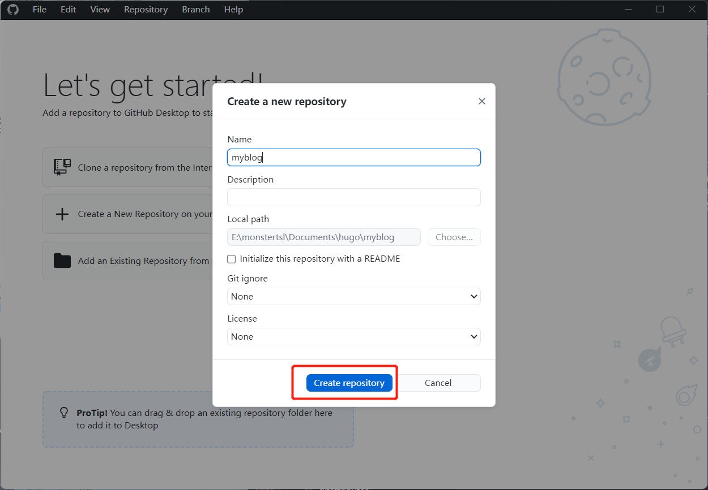


它会自己将全部文件添加到暂存区，这个时候点击任何一个`Publish repository`开始推送，如果开始没有登陆过它就会弹出让你登陆，点击`Sign in`它会弹出提示使用浏览器登陆，按照它的提示登陆即可,登陆成功后再点击`Publish repository`会让你填写命名远程仓库，这个时候也可以直接默认就行，然后就会开始上传，上传完成后，也可以再GitHub仓库里面看见这个仓库
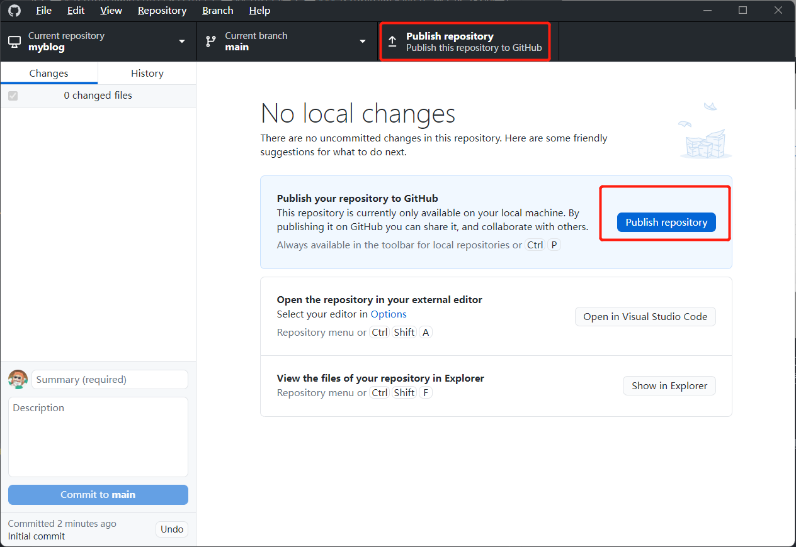
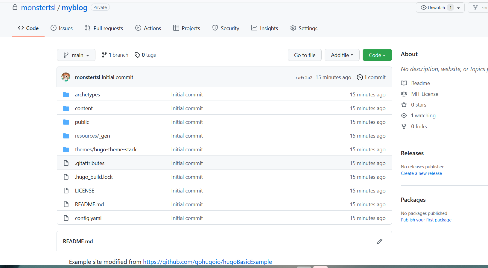

**在登陆和之后的上传过程中可能受到网络环境的影响请不要着急，如果上传失败多上传几次就好了**

### 使用git工具上传

如果需要使用git工具进行上传需要先安装git工具，点击这个➡[git](https://git-scm.com/downloads)，关于git这个工具的安装在这里就不做过多的阐述，如果有不会的小伙伴可以参考一下这篇文件[Git下载、安装与环境配置](https://blog.csdn.net/huangqqdy/article/details/83032408),或者可以去看看别的安装教程


当我们创建好一个空白的仓库的时候，它其实会有提示我们怎么去推送到这个仓库

```
git init    #初始化仓库
git add .   #将文件添加到暂存区，这里的 . 表示全部文件
git commit -m "first commit"    #提交信息（可以自己修改）
git branch -M main  #重命名分支，因为尽量保持和远端同名（只有第一次需要弄）
git remote add origin https://github.com/monstertsl/mybolg.git  #添加远程仓库目标地址
git push -u origin main     #推送本地分支到远程的main分支
```

转到你的博客文件夹，打开终端，将这几条命令，逐条敲入，如果出现报错就查一下为什么(一般很少出现报错)，当出现下图这个提示的时候就表示已经全部上传上去了。

**受到网络环境的影响，一般最后推送上传那个步骤得多尝试几次**

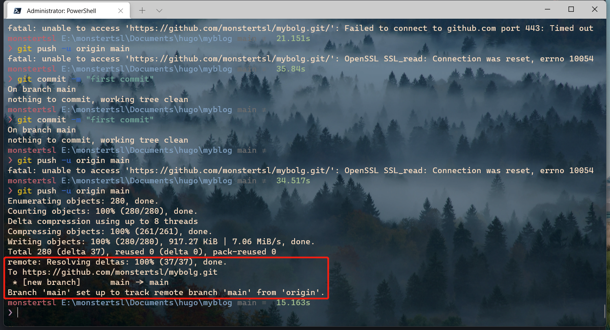

再登陆到GitHub里面看看也可以看见上传好了（框选出来的就是刚刚自定义的提交信息），这里会发现一个问题，就是为什么上传的文件夹和本地的不一样多，这是因为空文件夹不上传，还有就是每次上传的时候可以先将本地的`resources`这个目录删除，因为它是本地预览时临时生成的，并没有多大用处
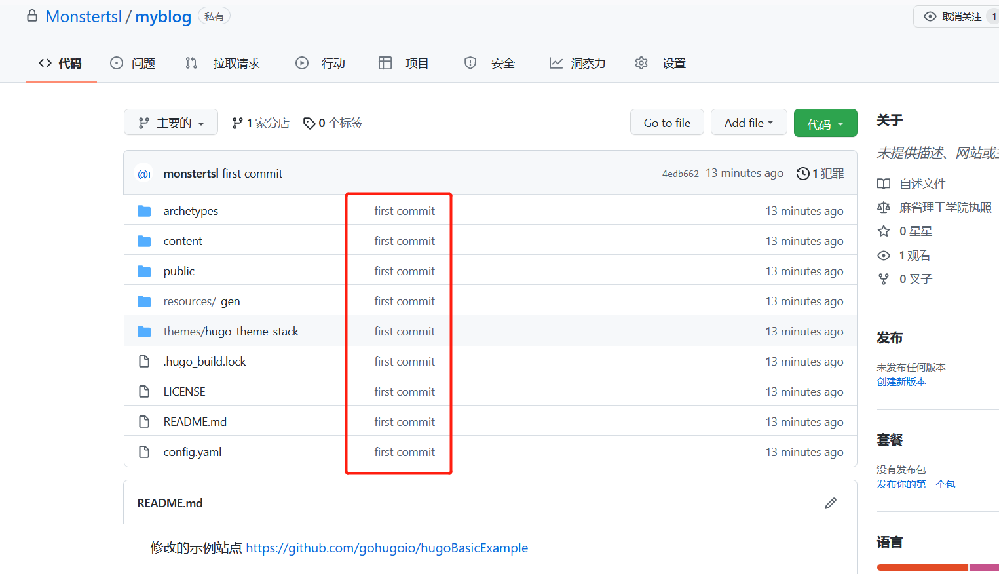

# 使用vercel来进行博客内容创建托管

## 创建vercel账号
打开[vercel](https://vercel.com)网站，点击右上角的`Login`，然后直接选择使用GitHub登陆就可以了（如果觉得慢，也可以用邮箱创建账号登陆）
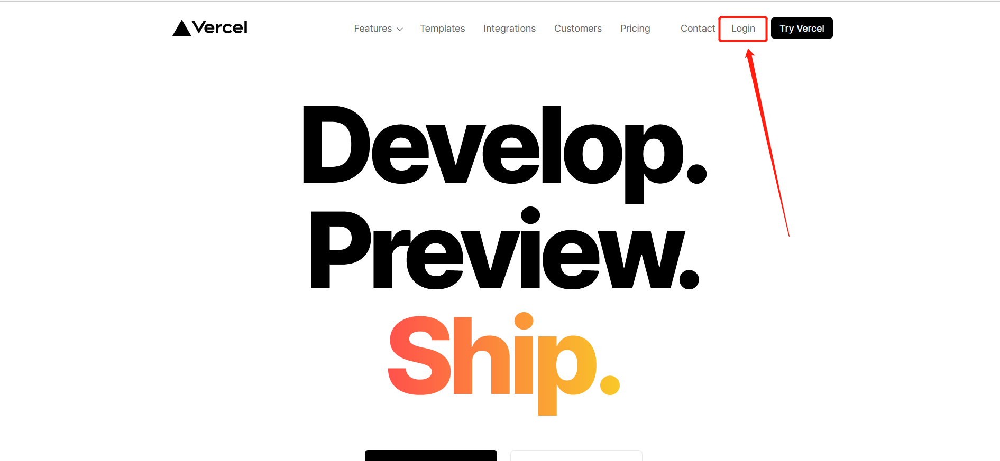
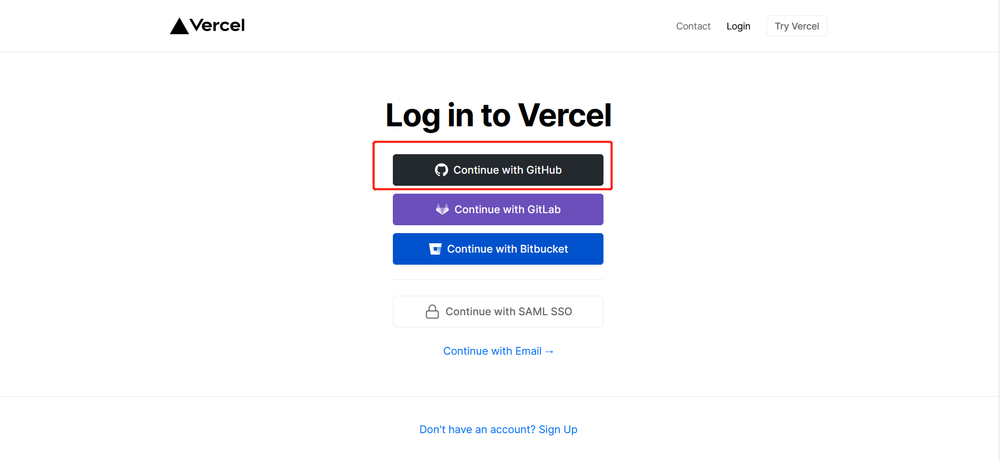

## 创建托管项目

登陆成功后，点击页面上的`New Project`创建新的项目
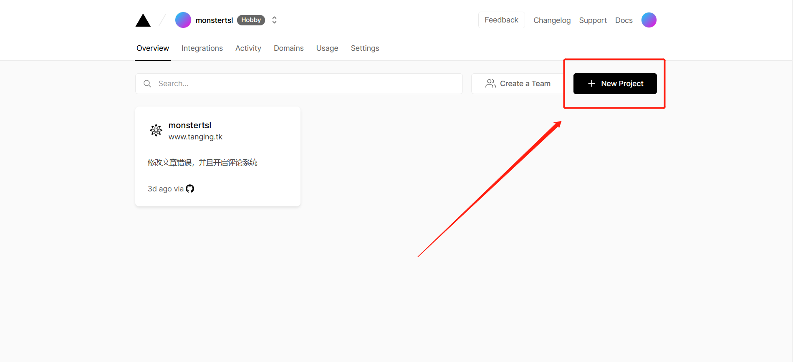

选择从GitHub导入
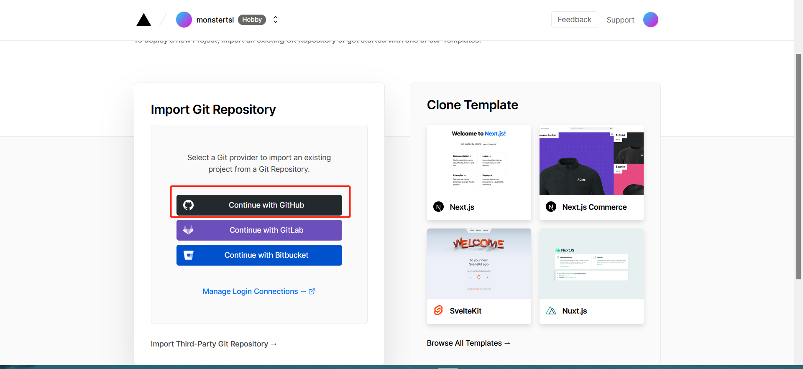

选择我们的博客文件
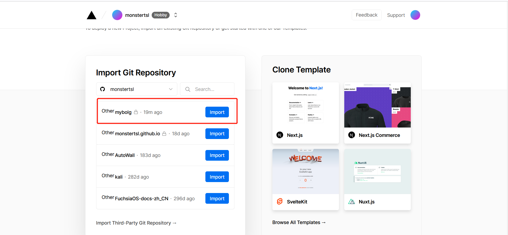

`Project Name(项目名称)`可以自己随便命名，在`Framework Preset(框架)`选择Hugo，然后点开下面的，`Environment Variables(环境变量)`添加一条变量名称为`HUGO_VERSION`，值为本地hugo版本号的变量，再点击`Add`添加，设置好后点击下面的`Deploy(部署)`就会开始部署
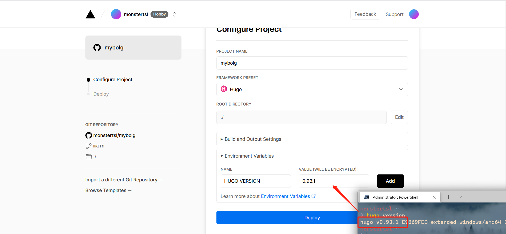

只需要稍等片刻，就会创建好我们的静态页面，我们可以通过它给到域名来访问，也可以自己购买域名进行绑定
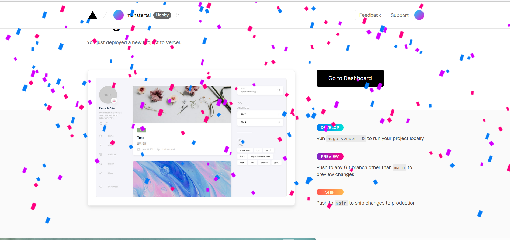
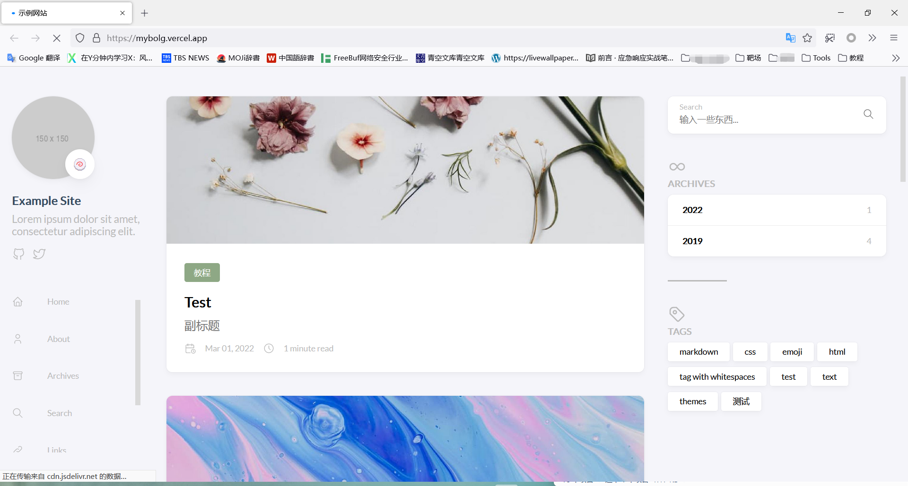

>如果有什么不明白的地方，请给我留言哦，或者发邮件给我，看见我都会回复的