---
#标题
title: "零基础，从0到有使用hugo搭建个人博客"
#副标题
description: 保姆级教程，识字的老奶奶都看得懂
#日期
date: 2022-03-03
#封面图片
image: cover.png
#协议信息，可以设置false
license: 
#优先级
weight: 
#隐藏文章，默认false
hidden: false
#分类
categories:
    - 教程
    - 笔记
#标签
tags:
    - Hugo
    - 
#显示 / 隐藏目录，默认true
toc:
#最后修改时间
lastmod:
---

## 前期准备:

hugo、GitHub账号、vercel账号（当然后面两项其实并不着急，我们可以一步一步来）

## 下载hugo

打开hugo的官网[hugo](<https://gohugo.io/>),这边建议使用github下载

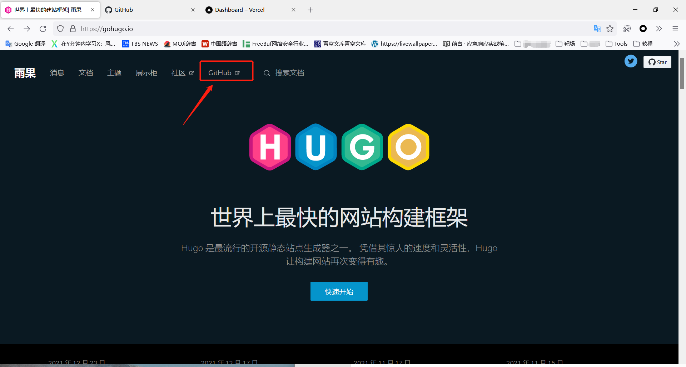
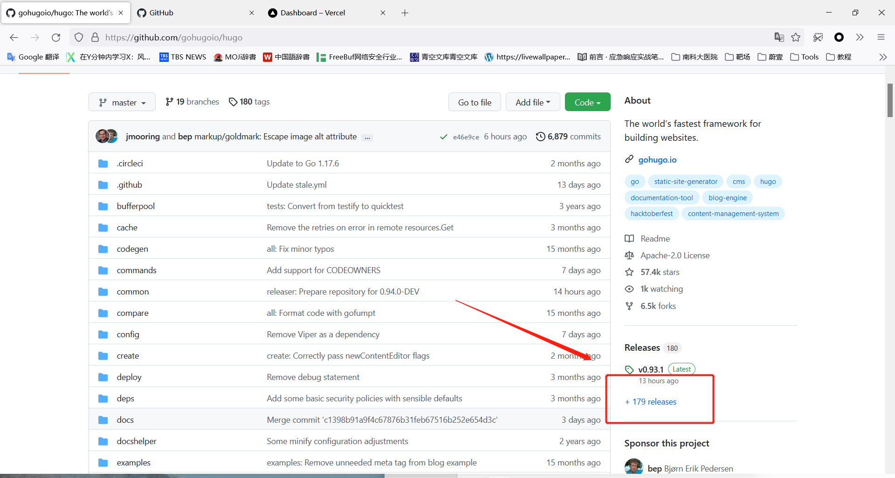

hugo的版本号可以自己选择，一般最新就行，再根据自己的操作系统下载对应的版本，一般下extended的兼容性会比较好，我是Windows操作系统所以这里下载Windows对应的版本

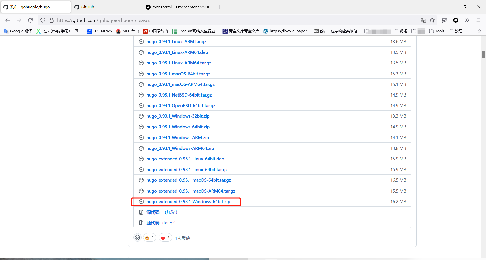

将下载的文件解压到一个自己喜欢或者平时安装软件的文件夹

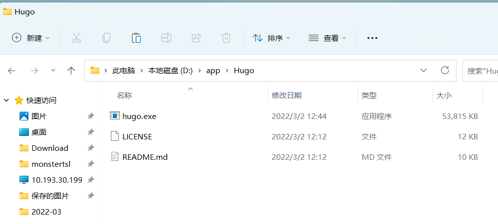

修改环境变（具体怎么打开修改环境变量的窗口在这里就不做过多阐述，请自行查询资料）

（算了我还是讲一下把：在此电脑右键属性-高级系统设置-环境变量-系统变量Path-双击进去-修改，然后把刚刚放hugo文件的文件夹路径放进去，再确定即可））

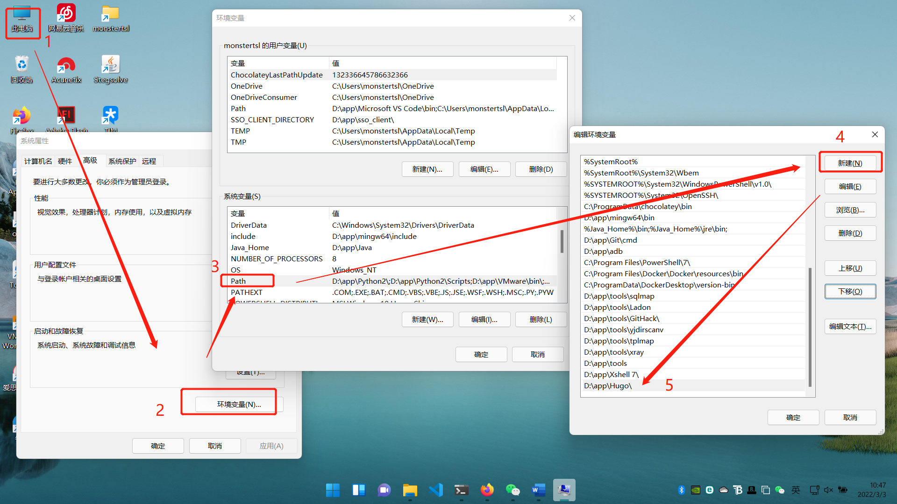

一般现在环境变量是会即刻生效的，如果没有生效就重启一下电脑，如果还是没有生效就检查一下是不是路径写错了

验证环境变量是否生效

在控制台输入`hugo version`如果可以正常显示版本号就表示hugo环境以及配置成功

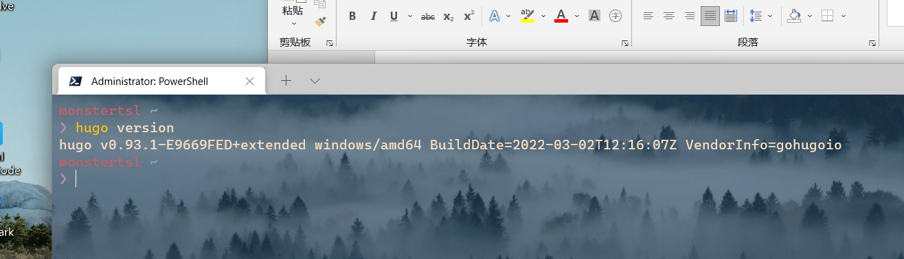

**到这里可以说已经成功了一半了**

转到你准备用来存放博客的文件夹使用命令`hugo new site myblog`(这个myblog可以自己定义，这个是博客网站的名称)

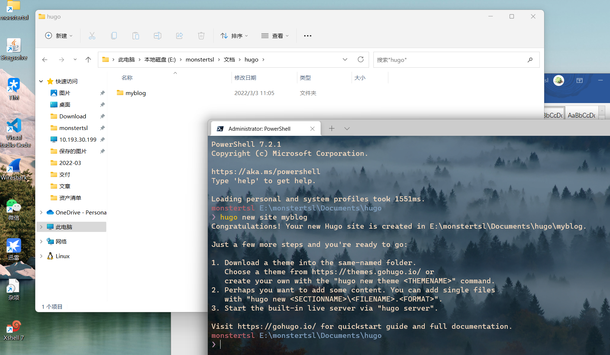

### 关于如何转到目标文件夹的问题

1. 如果有安装*Windows Terminal*或者win11可以直接右键-在Windows终端中打开，或者在上面的路径框框输入wt或者cmd它就会在本目录打开

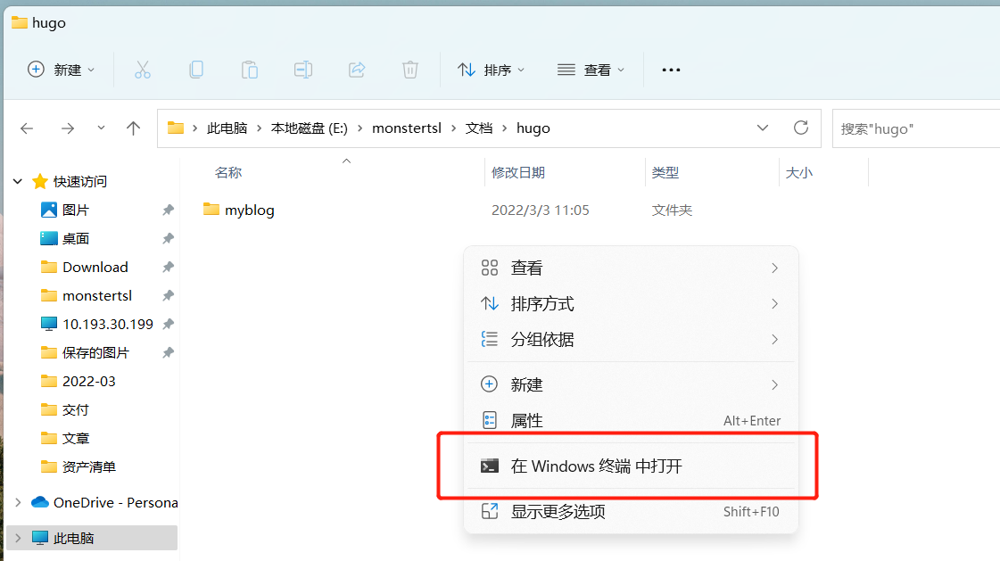

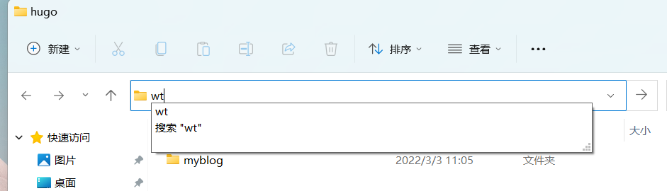

2. 如果没有安装*Windows* Terminal，在这个目录按住shift再右键-在此处打开Powershell窗口，或者在上面的路径框框输入cmd也都可以

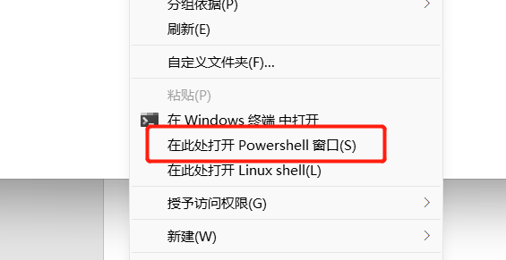

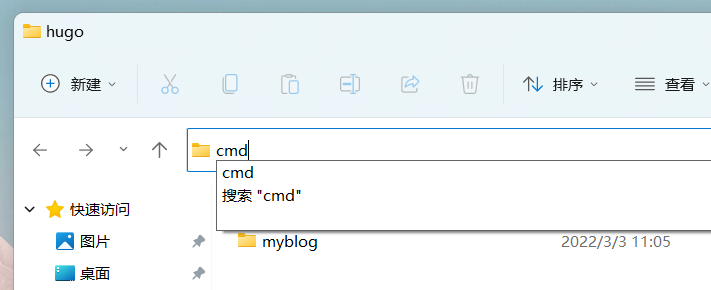

## 配置主题

当我们的博客生成好以后我们是需要选择一个自己喜欢的主题的

打开hugo官网，找到主题入口

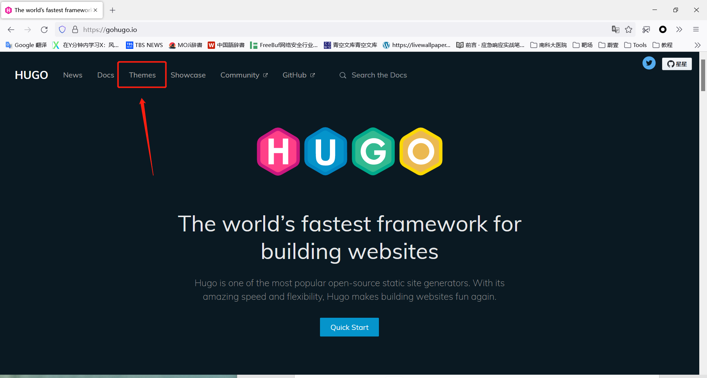

选择一个自己喜欢的主题

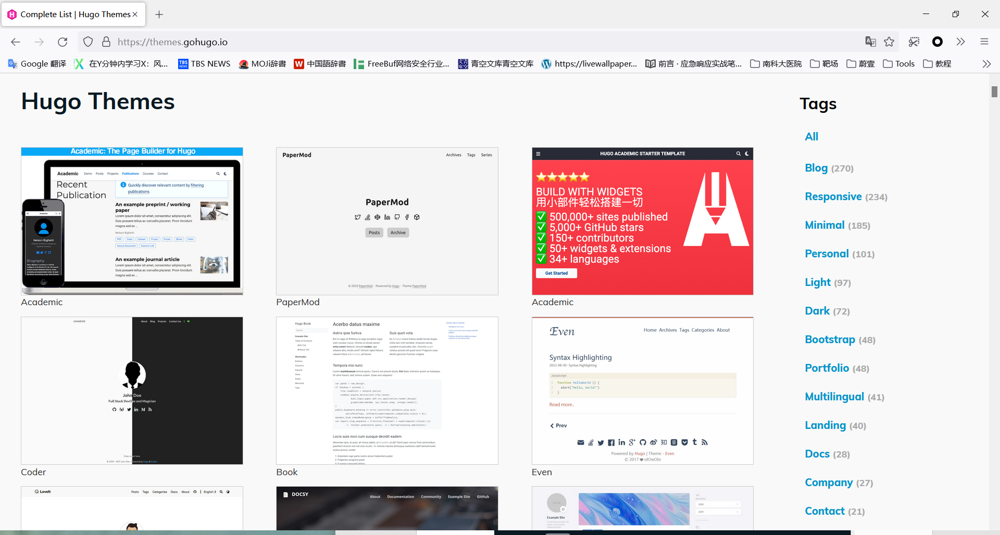

我这里以Stack这个主题为例，下载

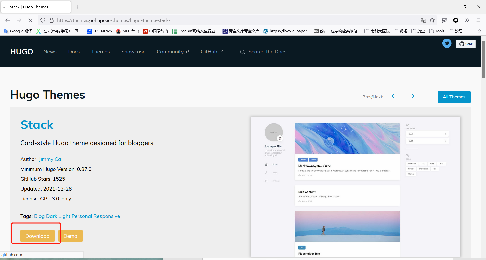

一般在下面都会有如何配置的提示，不同主题的配置不同具体看相关主题介绍，这里不做过多阐述，网上有很多别的主题配置的具体教程

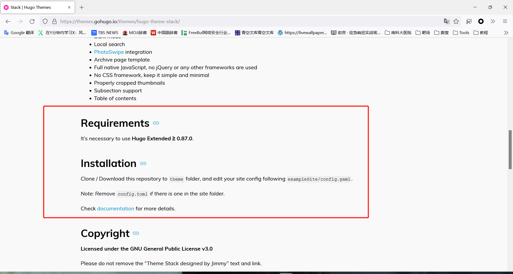

将下载下来的主题文件解压到博客的themes目录

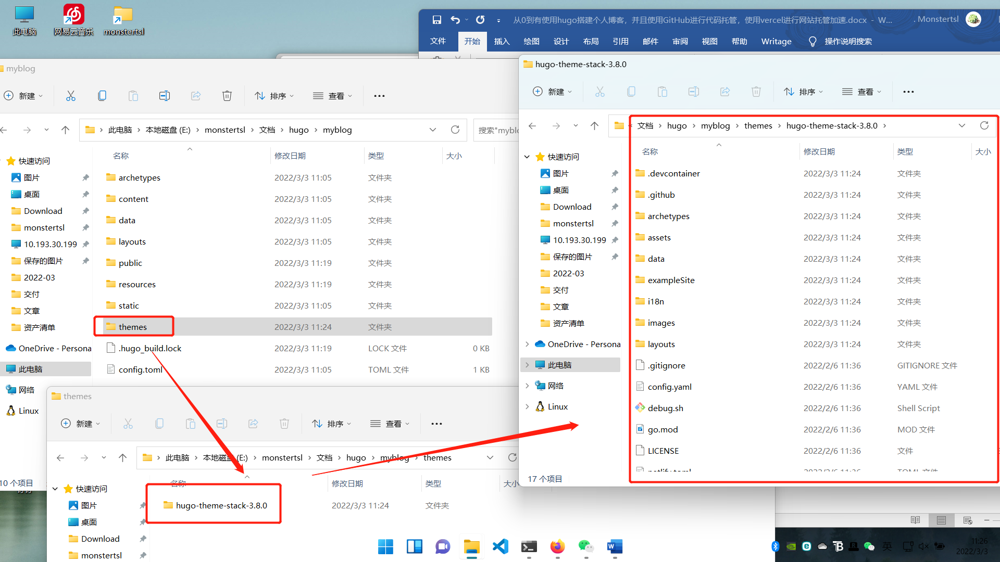

根据这个主题的配置要求，将主题文件里面exampleSite目录全部复制到博客目录，并且删除原有的配置文件`config.toml`（这里只是针对stack这个主题，不同主题看具体要求）

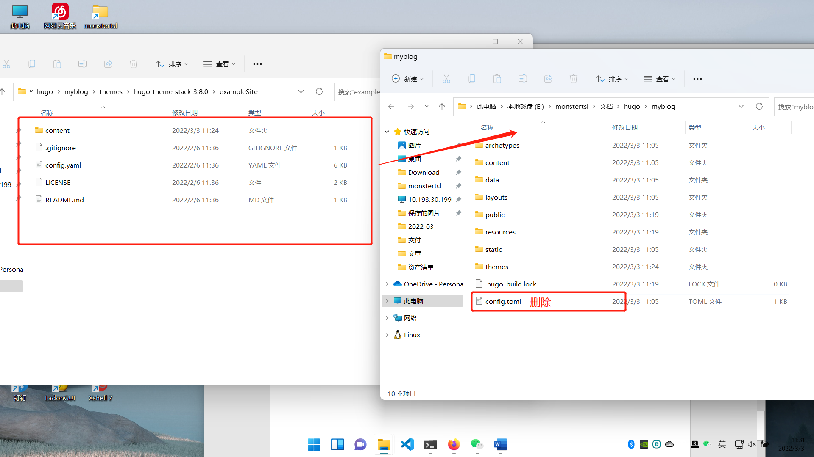

我们打开配置文件`config.yaml`,发现主题它写的是`hugo-theme-stack`这个名字是需要和themes主题文件夹里面的名字对应的，所以，我们还需要将themes里面的主题文件夹进行正确命名

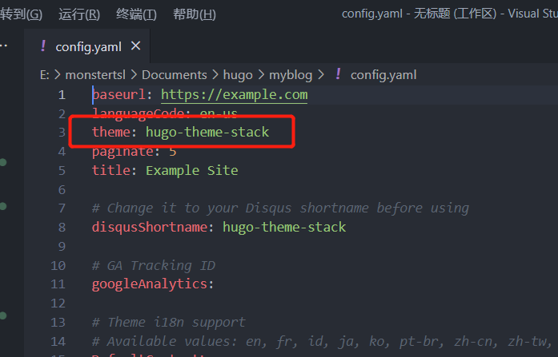

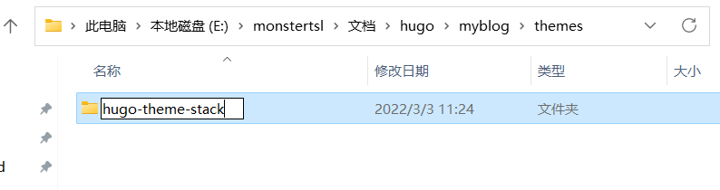

到这里，我们的配置基本上就完成了，使用命令进行预览看看

在博客文件夹使用命令 `hugo server`启动本地预览（这里出现了一个错误，是因为没有相关的配置文件，我们把这篇文章删除就好了，根据提示删除这个文件就好了）

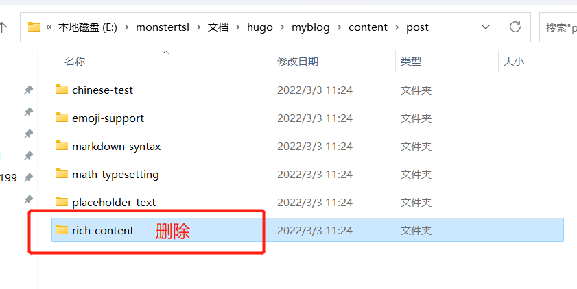

这样就是启动成功了，在浏览器打开它提示的路径就可以预览，也可以按`Ctrl+C`结束它

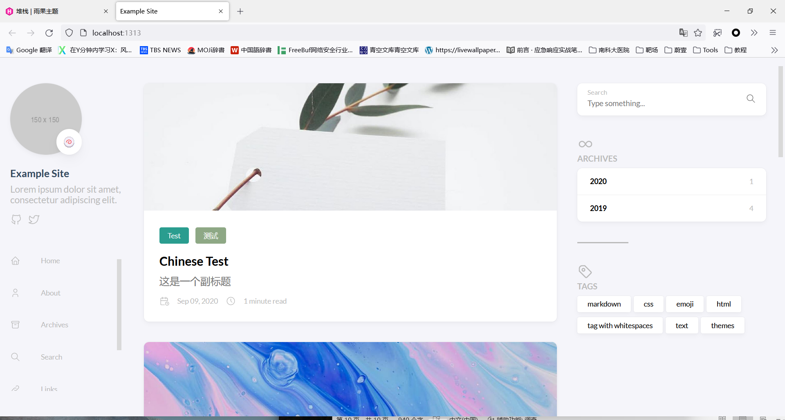

## 开始创作

到现在这个地方，目前最难的部分都已经全部结束了，接下来就是要开始创作了，在创作之前我还需要给大家介绍一下相关目录是做什么的（这里以我的站点为例只介绍几个大概率会用到的目录）

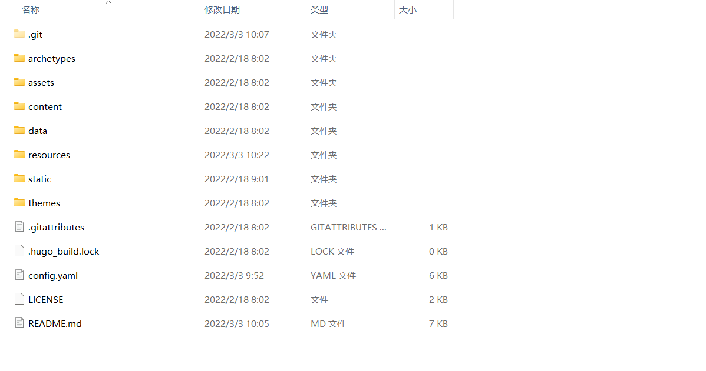

**目录解释**
```
assets：这个默认是没有的可以自己创建是用来存放一些个人资源图标或者头像之类

content：文章和页面上看的见的东西都放在这个里面，里面有三个目录categories、page、post

categories：是用来存放标签封面的其实它可以不要

page：就是用来存放页面左右两边的那些功能按钮的它是可以自己定义的

post：目录是用来存放具体的文章的，就是我们在页面上的文章

date：用来存放一些别的配置文件

resources：预览时自动生成用来存放预览生成的文件

static：存放主题文件

config：配置文件它的扩展名可以是yaml或者toml，具体看主题而定，一般下载主题的时候里面附带了配置好的配置文件，复制过来就能用

```


### 现在有两种方法来创建新的文章

在博客文件夹使用命令`hugo new test.md`(这个md文件可以自己命名，hugo主要是采用md来进行文章的排版)，这个命令会直接在content里面创建文件的md文件

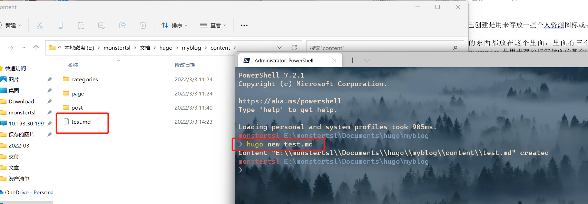

当然为了方便管理，可以尽量将文章文件创建在post目录里面，只要加上对应的目录即可

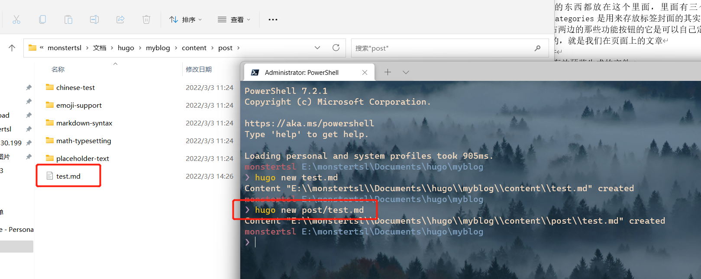

但是假如我们想要在文章里面插入一些插图或者别的东西，为了方便管理，我们可以在post目录里面创建对应的文章文件夹

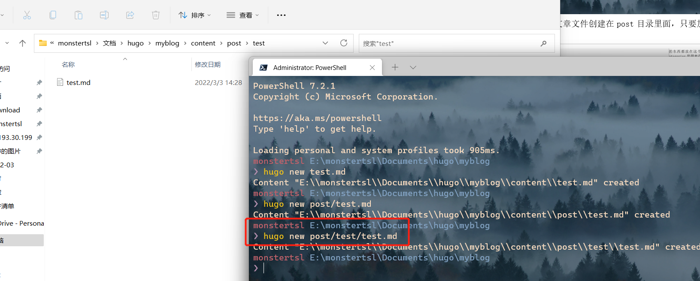

hugo会读取content下面的post以及post下面的子目录里面的md文件以此来生成文章页面，当然，除了用命令创建直接使用手工创建也是可以的，并不会影响使用，并且建议创建文章文件的时候尽量在post里面创建一个自定义命名的子目录且文章文件尽量命名为**index.md**，这样也会比较规范

**所以不要直接使用`hugo new test.md`来创建新的文章页面，请加上`post`目录或者尽量在`post`目录里面创建子目录来管理文章**

## 现在我们来对文章文件主体内容进行编辑

首先文章的头部是有一些关于文章内容的关键字的这些是必须的，例如下面这些

```

#标题
title: "TEST"

#副标题
description: 

#日期
date: 

#封面图片
image: 

#协议信息，可以设置false,也可以自己设置
license: 

#优先级，在主页上面显示的优先级
weight: 

#评论开关，评论系统是需要配置的，默认false,如果使用了这个关键字会关闭评论，如果要开启评论，删除这个关键字即可
comments: 

#隐藏文章，默认false
hidden: true

#分类
categories:
    - 

#标签
tags:
    - 

#显示 / 隐藏目录，默认true
toc:

#最后修改时间
lastmod:

```

可能这样不是很好理解，现在我们通过对它进行编辑然后就明白了

现在写了对内容进行了修改，其中封面直接放在文章文件同目录就可以，再写入图片名称即可

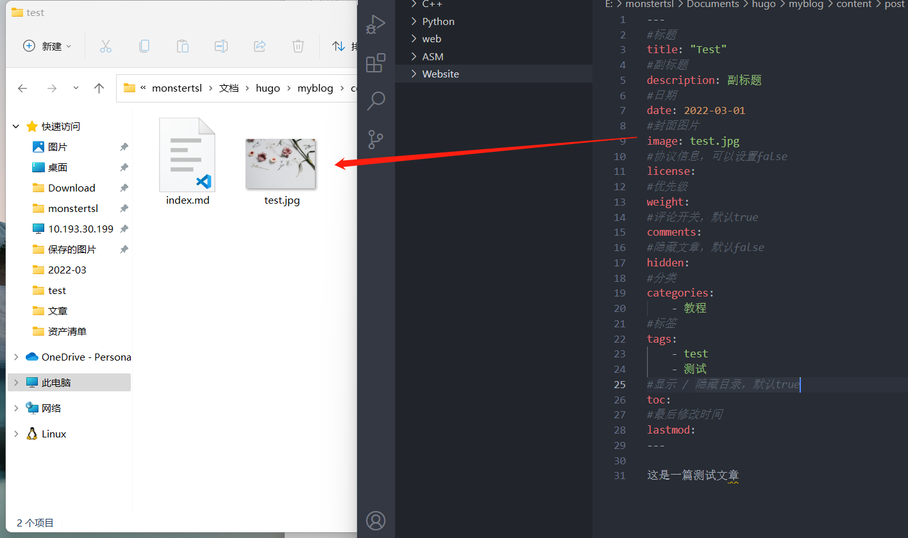

在首页上可以看见的就是标题、副标题、日期、分类以及封面图片这些

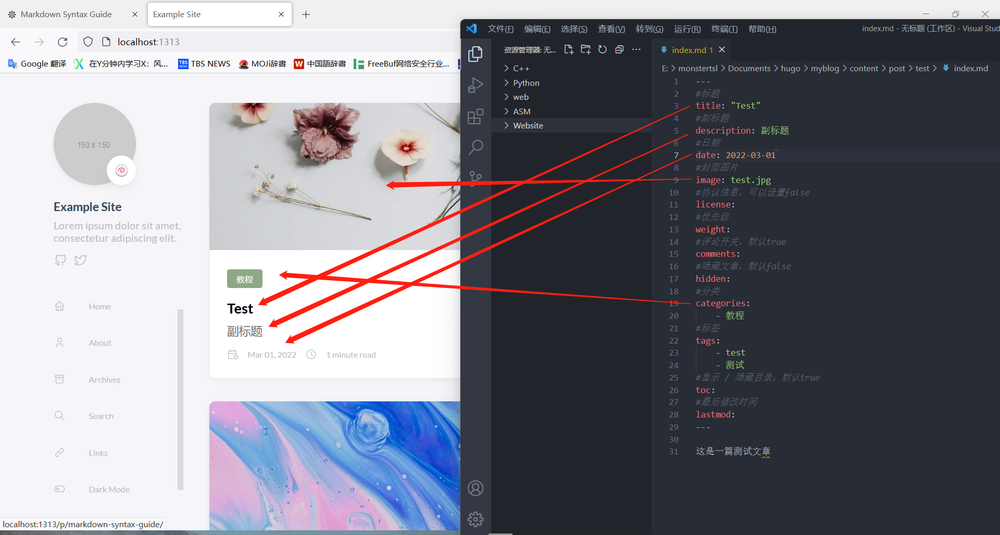

而进去文章主体后就可以看见标签以及协议信息等，当然协议信息的内容是可以自定义的

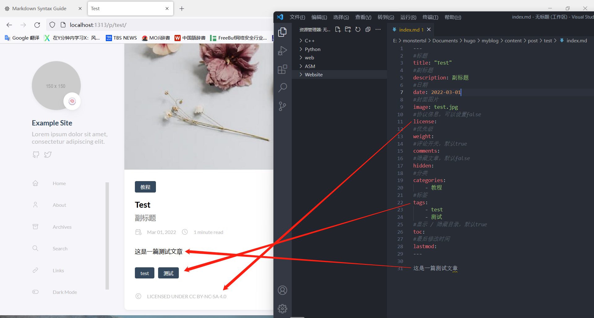

>这边建议尽量有几个固定的分类，分类不要太多不然就会很杂乱，当然一篇文章是可以打上多个分类和标签的。对于一些md语法的内容在这里也不过多的阐述，网上有很多优秀的教程，在修改文章前也可以直接使用`hugo server`打开本地预览，hugo是一个动态的框架，你所做的修改它都会直接生效，这样也会比较直观
